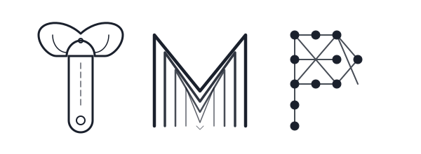

# Tool Mapping Protocol (`tmp`)

<p align="center">
  
</p>

**TMP is a protocol for turning intent into verified operations.**

> Before a human, terminal, or AI agent runs something, TMP shows the correct road, the required inputs, the possible side effects, and the shape of the result.

The first implementation is a Rust workspace that ships an embeddable core library (`tmp-core`), a user-facing CLI (`tmp`), a cross-platform command wrapper (`command`), and an agent-facing HTTP adapter (`tmp-agent`). TMP is designed to be embedded into your own tools — the CLI is one consumer of the library, not the only way to use TMP.

TMP does not call language model APIs or manage provider keys. The deterministic core stays independent of AI providers. If a user wants model-assisted schema authoring, they use their preferred external agent to produce draft files that TMP verifies.

---

## The Problem

Modern developer environments have many ways to perform actions — commands have flags, APIs have endpoints, databases have schemas, workflows have steps, scripts have undocumented arguments. Without TMP, an AI agent often has to:

```text
read files → search scripts → inspect docs → run help → guess command → run → recover
```

That is expensive and unreliable. With TMP, the flow becomes:

```text
compile map → resolve intent → invoke verified operation → return shaped result
```

**The important rule:** If TMP cannot resolve the operation, it fails closed. A visible "not mapped" result is better than a confident guess.

---

## What TMP Maps

TMP is bigger than a CLI helper. The protocol can map any surface where an action can be invoked:

| Surface    | Example               | TMP Value                |
| ---------- | --------------------- | ------------------------ |
| CLI        | `cargo test`          | known flags & parameters |
| API        | `POST /deployments`   | schema + effects         |
| SQL        | `recent_failed_jobs`  | safe query templates     |
| Workflow   | `release_candidate`   | ordered steps            |
| Script     | `sync-data`           | documented args          |
| Completion | `<TAB>`               | dynamic values           |
| Agent tool | `resolve_intent`      | grounded lookup          |
| Output     | test summary          | less noise               |

The current Rust implementation covers **CLI**, **Workflow**, **Script**, and **Completion** surfaces. API, SQL, and output policy surfaces are defined in the protocol but not yet implemented as surface adapters.

---

## Core Model

TMP is built around one unit: the **operation**.

```text
surface → operation → parameters → resolvers → invocation → effect → output policy
```

| Term         | Meaning                                 | Example                                        |
| ------------ | --------------------------------------- | ---------------------------------------------- |
| Surface      | Where the action lives                  | CLI, API, SQL, workflow, script                |
| Operation    | A thing that can be invoked             | `cargo.test`, `sql.recent_failed_jobs`         |
| Parameter    | Input required by the operation         | `branch`, `environment`, `limit`               |
| Resolver     | How valid values are discovered         | `git:branches`, `cargo:bins`, `npm:scripts`    |
| Invocation   | The concrete action to perform          | shell command, HTTP request, query template    |
| Effect       | What can happen                         | read-only, build-test, network, destructive    |
| Output policy| How results are returned                | raw, test summary, diff summary                |
| Evidence     | Why the map is trusted                  | help text, test, human review, registry signature |

---

## Workspace

```text
.
├── Cargo.toml                  # Workspace root (4 members)
├── tmp-core/                   # Core protocol library (embeddable)
│   └── src/
│       ├── schema.rs           # Operation schema data model & validation
│       ├── resolve.rs          # Heuristic intent → command resolution
│       ├── compile.rs          # Workspace context compiler & markdown generator
│       ├── context.rs          # Project/build/git context detection
│       ├── generate.rs         # Deterministic schema generation from help text
│       ├── help.rs             # Recursive --help BFS crawler
│       ├── resolver.rs         # 10 built-in dynamic token resolvers
│       ├── run.rs              # Multi-strategy command execution engine
│       ├── registry.rs         # Schema registry client (GitHub, HTTP, file://)
│       ├── versioning.rs       # Immutable schema history, rollback & diff
│       └── config.rs           # Configuration path resolution
├── tmp/                        # User-facing CLI binary
│   └── src/
│       ├── commands/           # init, generate, compile, resolve, run, schema,
│       │                       # registry, workflow, init-agent
│       ├── main.rs             # Clap-derived CLI with global --config flag
│       └── tui/                # Interactive schema verification TUI (ratatui)
├── crates/
│   ├── command/                # Cross-platform std::process::Command wrapper
│   └── tmp-agent/              # Agent-facing Axum HTTP server
│       ├── src/
│       │   ├── lib.rs          # 11 REST endpoints, DB helpers, subagent orchestration
│       │   └── main.rs         # Server startup, workflow generation mode
│       └── tests/
├── docs/whitepaper/            # Protocol whitepaper (Draft 0.4) & benchmark plan
├── tests/                      # 4-tier E2E test suite
└── scripts/                    # Whitepaper PDF rendering (Pandoc + Typst)
```

---

## Using TMP as a Library

The core value of TMP lives in `tmp-core`. You can embed schema resolution, context detection, compilation, and execution directly into your own tools without going through the CLI.

### `tmp-core` — The Protocol Engine

```toml
[dependencies]
tmp-core = { path = "tmp-core" }
```

#### Modules

| Module       | Status | Purpose                                                         |
| ------------ | ------ | --------------------------------------------------------------- |
| `schema`     | ✅     | Parse, validate, and serialize operation schemas                |
| `resolve`    | ✅     | Match natural-language intent to a schema-backed command        |
| `compile`    | ✅     | Build workspace context and resolved command maps               |
| `context`    | ✅     | Detect project structure, build system, git state, npm scripts  |
| `generate`   | ✅     | Draft schemas from recursive `--help` text                      |
| `help`       | ✅     | BFS help-text crawler (max 20 commands, depth 2)                |
| `resolver`   | ✅     | 10 built-in resolvers + arbitrary shell command resolvers       |
| `run`        | ✅     | Execute resolved commands with contextual file-type inference   |
| `registry`   | ✅     | Search, install, and publish schemas (local publish, remote read) |
| `versioning` | ✅     | Immutable schema history with rollback and unified diff         |
| `config`     | ⚠️     | Path resolution works; `Config` struct is a stub                |

#### Schema Data Model

The schema is the foundation of TMP. Every module reads or produces schemas.

```rust
use tmp_core::schema::{Schema, SchemaMeta, Command, Token, TokenType, DataSource};

// Parse a schema from JSON (validates on deserialization)
let schema = Schema::from_json(json_str)?;

// Validate explicitly
schema.validate()?;

// Strip dynamic data sources for sharing
let shareable = schema.export_shareable();
```

A schema contains:
- **`SchemaMeta`** — tool name, version, author, verified status, keywords, prerequisite constraints (`requires_binary`, `requires_file`, `requires_file_kind`)
- **`Command`** — command template string, description, group, verification status, tokens
- **`Token`** — named parameter with type (`String`, `Boolean`, `Enum`, `File`, `Number`), optional flag, default value, static values, or a dynamic `DataSource`
- **`DataSource`** — either a built-in resolver name (e.g. `cargo:tests`) or a shell command, with parse mode (`lines` or `words`)

#### Resolve Intent Programmatically

```rust
use tmp_core::context::Context;
use tmp_core::resolve;

let context = Context::detect(".", None, None);

match resolve::resolve("run unit tests", &context, None, None) {
    Ok(result) => {
        println!("Command:    {}", result.command);     // e.g. "cargo test"
        println!("Tool:       {}", result.tool);        // e.g. "cargo"
        println!("Confidence: {}", result.confidence);  // "high" or "medium"
        for fill in &result.tokens_filled {
            println!("  {} = {} ({})", fill.name, fill.value, fill.source);
        }
    }
    Err(e) => eprintln!("Not mapped: {}", e),  // fails closed
}
```

Resolution uses heuristic scoring (no LLM):
- Command words: **15 pts**, description words: **5 pts**, keywords: **8 pts**, group: **5 pts**
- Token filling: query match → default value → positional guess (required tokens only)
- Schema relevance filtering by `requires_binary`, `requires_file`, `requires_file_kind`
- Confidence: `high` (score > 20) or `medium`

#### Compile Context

```rust
use tmp_core::compile::Compiler;
use tmp_core::context::Context;
use std::path::Path;

let cwd = Path::new(".");
let context = Context::detect(".", None, None);

// Compile all relevant schemas with resolved token values
let output = Compiler::compile(cwd, &context, None).unwrap();

// Write .tmp/commands.json and .tmp/context.md
Compiler::write_to_disk(cwd, &output).unwrap();

// Or generate markdown programmatically
let markdown = Compiler::generate_markdown(&output);
```

The compiler:
1. Loads all schemas from the `schemas/` directory
2. Filters by relevance (checks binary availability, required files, file kind)
3. Resolves all dynamic token data sources via `DataResolver`
4. Produces `CompileOutput` containing `Context` + `Vec<ResolvedCommand>`
5. Writes `.tmp/commands.json` (machine-readable) and `.tmp/context.md` (agent-readable)
6. Auto-manages `.gitignore` to exclude `.tmp/`

#### Detect Project Context

```rust
use tmp_core::context::Context;

let ctx = Context::detect(".", None, None);

println!("Build system: {}", ctx.build_system);   // cargo, npm, go, python
println!("File kind:    {}", ctx.file_kind);       // cargo_project, npm_project, ...
println!("Packages:     {:?}", ctx.packages);      // workspace members
println!("Bins:         {:?}", ctx.bins);           // binary targets
println!("Tests:        {:?}", ctx.tests);          // test targets
println!("Git branches: {:?}", ctx.git_branches);
println!("NPM scripts:  {:?}", ctx.npm_scripts);
```

Context detection covers:
- **Build systems**: Cargo (workspace-aware, parses glob members), npm, Go, Python
- **Project structure**: packages, bins, examples, tests, benches, features, profiles
- **Git state**: branches, remotes
- **Script engines**: `rust-script`, `cargo +nightly -Zscript`
- **npm**: scripts from `package.json`

#### Built-in Token Resolvers

The `DataResolver` provides 10 built-in resolvers that pull live values from the detected context:

| Resolver           | Source                           |
| ------------------ | -------------------------------- |
| `cargo:packages`   | Cargo workspace members          |
| `cargo:bins`       | Binary targets                   |
| `cargo:examples`   | Example targets                  |
| `cargo:features`   | Cargo features                   |
| `cargo:profiles`   | Build profiles                   |
| `cargo:tests`      | Integration test targets         |
| `cargo:benches`    | Benchmark targets                |
| `git:branches`     | Local git branches               |
| `git:remotes`      | Configured git remotes           |
| `npm:scripts`      | npm scripts from package.json    |

Custom resolvers can run arbitrary shell commands and parse output as `lines` or `words`.

#### Schema Versioning

```rust
use tmp_core::versioning;

// Save with automatic version increment
versioning::save_schema("cargo", &schema_json, None)?;

// View version history
let history = versioning::get_history("cargo", None)?;

// Rollback (creates a new version from a prior one)
versioning::rollback("cargo", 2, None)?;

// Generate unified diff between two schema JSON strings
let diff = versioning::generate_diff(&old_json, &new_json);
```

Versioning uses dual-write: active schema at `schemas/<tool>.json` plus versioned copies at `schemas/versions/<tool>/v<N>.json`. History is immutable — rollback creates a new version.

#### Schema Registry

```rust
use tmp_core::registry::RegistryClient;

// Connect to a GitHub-hosted registry
let client = RegistryClient::new("codeitlikemiley/tmp-registry");

// Search for schemas
let results = client.search("cargo")?;

// Install a schema to local directory
client.install("cargo", &schemas_dir)?;

// Publish (currently only file:// registries)
client.publish("cargo", &schema_json)?;
```

The registry client supports GitHub repos, HTTP URLs, and `file://` paths. Remote publishing is defined but not yet implemented — local `file://` publish works fully.

---

### `command` — Cross-Platform Process Execution

A thin wrapper around `std::process::Command` that suppresses console window creation on Windows (`CREATE_NO_WINDOW` flag). Drop-in replacement for cross-platform tools.

```toml
[dependencies]
command = { path = "crates/command" }
```

```rust
use command::Command;

let output = Command::new("cargo")
    .arg("test")
    .current_dir("/path/to/project")
    .output()
    .expect("failed to execute");
```

---

### `tmp-agent` — Agent-Facing HTTP Server

An Axum-based HTTP server that exposes TMP capabilities and tool-use primitives to AI agents over REST. Runs on `127.0.0.1` with configurable port (`TMP_AGENT_PORT` env var or OS-assigned).

```toml
[dependencies]
tmp-agent = { path = "crates/tmp-agent" }
```

#### Endpoints

| Method | Path            | Purpose                                           |
| ------ | --------------- | ------------------------------------------------- |
| GET    | `/status`       | Health check — returns agent availability          |
| POST   | `/chat`         | Send a message to the AI agent (Antigravity SDK)  |
| POST   | `/execute`      | Run a shell command with args and optional cwd     |
| POST   | `/read_file`    | Read file contents (sandboxed to workspace)       |
| POST   | `/write_file`   | Write file contents (sandboxed to workspace)      |
| POST   | `/subagent`     | Spawn an async subagent task (returns ID)         |
| GET    | `/subagent/:id` | Poll subagent status (Running/Success/Failure)    |
| POST   | `/log`          | Structured logging (info/warn/error/debug)        |
| POST   | `/db/tables`    | List database tables (SQLite or PostgreSQL)       |
| POST   | `/db/columns`   | Get column metadata for a table                   |
| POST   | `/db/query`     | Execute read-only SQL (SELECT/WITH only)          |

**Security model:**
- File operations are sandboxed to the workspace directory via path canonicalization and traversal detection
- SQL queries are restricted to `SELECT`/`WITH` — mutating keywords (`INSERT`, `UPDATE`, `DELETE`, `DROP`, `ALTER`, `CREATE`, `TRUNCATE`, `REPLACE`) are blocked after SQL comment stripping and string-aware tokenization
- SQLite databases are opened read-only
- Subagent pool is bounded to 100 entries with FIFO eviction

**Modes:**
- **Server-only** (`--server` flag or `TMP_AGENT_SERVER_ONLY` env): keeps the HTTP server running indefinitely
- **Workflow mode** (when `TMP_DB_PATH` is set): generates a Python orchestration script via Gemini (or static fallback), executes it against the loopback server, then validates and compiles the resulting schema

---

## CLI Quick Start

```bash
# Initialize TMP in your environment
tmp init

# Generate a schema from a CLI tool's help text
tmp generate cargo
tmp generate cargo --verify    # interactive TUI verification

# Compile workspace context + schemas
tmp compile
tmp compile --watch            # auto-recompile on file changes

# Resolve natural-language intent to a command
tmp resolve "run unit tests"
tmp resolve "run unit tests" --json    # full resolution structure
tmp resolve "build release" --tool cargo

# Execute the resolved command
tmp run
tmp run src/main.rs            # contextual file execution
tmp run --dry-run              # preview without executing
```

### Agent Integration

```bash
# Generate instruction files for external coding agents
tmp init-agent claude          # creates CLAUDE.md
tmp init-agent cursor          # creates .cursor/rules/tmp.mdc
tmp init-agent codex           # creates AGENTS.md
tmp init-agent copilot         # creates .github/copilot-instructions.md
tmp init-agent windsurf        # creates .windsurfrules
tmp init-agent all             # all of the above
```

The generated instruction files tell the external agent to use `tmp resolve "<intent>"` before running unknown commands.

---

## CLI Commands

### `init`

Creates `~/.config/tmp/schemas/` and a minimal `config.toml`. The default config is intentionally minimal and contains no API provider settings.

### `generate <tool>`

Generates an unverified draft schema from help text. Runs `<tool> --help` recursively (BFS, max 20 commands, depth 2) and parses the output into a structured schema. Draft schemas are saved with version history.

| Flag                          | Purpose                                          |
| ----------------------------- | ------------------------------------------------ |
| `--help-text <PATH\|COMMAND>` | Read help from file, directory, or run as command |
| `--verify`                    | Launch the interactive verification TUI           |
| `--non-interactive`           | Save without prompting                            |
| `--force`                     | Save even when output matches the latest version  |
| `--history`                   | Print schema version history                      |
| `--rollback <VERSION>`        | Restore a prior schema as a new version           |

Draft output is marked `verified: false` with coverage `"draft-from-help-text"`. Treat it as a bootstrap artifact, not a complete or trusted command contract.

### `schema`

Manages local schemas:

| Subcommand                  | Purpose                                           |
| --------------------------- | ------------------------------------------------- |
| `schema list`               | List all schemas in the local registry            |
| `schema share <tool>`       | Export a shareable copy (strips dynamic data sources) |
| `schema import <source>`    | Import from file path, `file://`, or `http(s)://` URL |
| `schema keywords <tool> [words...]` | View or replace schema keywords             |

### `registry`

Searches, installs, and publishes schemas through a registry source. Default repo: `codeitlikemiley/tmp-registry` (override via `TMP_REGISTRY_REPO` env var).

| Subcommand            | Purpose                                |
| --------------------- | -------------------------------------- |
| `registry search <q>` | Search by tool name or description     |
| `registry install <t>`| Download and save a schema locally     |
| `registry publish <t>`| Publish a shared schema to the registry |

### `compile`

Compiles project context and relevant schemas into `.tmp/commands.json` (machine-readable) and `.tmp/context.md` (agent-readable). Filters schemas by relevance, resolves all dynamic token values, and embeds agent rule files (`CLAUDE.md`, `CHATGPT.md`) into the context markdown.

Use `--watch` to auto-recompile on filesystem changes (ignores `.tmp`, `.git`, `target`, `node_modules`).

### `resolve "<query>"`

Resolves a natural-language query against installed schemas using local heuristic matching. If no schema match exists, the command fails closed instead of guessing. Input is sanitized (shell metacharacters stripped, max 1000 chars).

Successful resolution writes `.tmp/last_command.json`. Use `--json` for the full resolution structure, `--tool <name>` to scope to a specific tool.

### `run [file]`

Without arguments, runs the last resolved command from `.tmp/last_command.json`. With a file argument, uses contextual inference:

| File Context         | Command                                    |
| -------------------- | ------------------------------------------ |
| Single-file script   | `rust-script <file>`                       |
| Standalone `.rs`     | `rustc <file> -o <temp> && <temp>`         |
| `src/bin/<name>.rs`  | `cargo run --bin <name>`                   |
| `examples/<name>.rs` | `cargo run --example <name>`               |
| `tests/<name>.rs`    | `cargo test --test <name>`                 |
| `benches/<name>.rs`  | `cargo bench --bench <name>`               |
| npm project          | `npm test`                                 |

Use `--dry-run` to preview the command without executing.

### `workflow`

Imports and runs multi-step workflow definitions (JSON or YAML).

| Subcommand                      | Purpose                                  |
| ------------------------------- | ---------------------------------------- |
| `workflow list`                 | List workflows (project-local + global)  |
| `workflow add <name> --from <p>`| Import a workflow definition              |
| `workflow run <name>`           | Execute workflow steps sequentially      |

Workflow features:
- **Token substitution**: `{{TOKEN}}` and `<TOKEN>` replaced from environment variables
- **Per-step timeouts**: `timeout_ms` or `timeout` (seconds) with child process kill
- **Recursion protection**: max depth 10 via `TMP_WORKFLOW_DEPTH` env var
- **Fail-fast**: halts on any non-zero exit step

---

## Schema Format

Schemas are JSON files under `~/.config/tmp/schemas/`. A minimal operation record:

```json
{
  "meta": {
    "tool": "cargo",
    "version": 1,
    "verified": false,
    "coverage": "draft-from-help-text",
    "requires_file": "Cargo.toml",
    "keywords": ["rust", "build", "test"]
  },
  "commands": [
    {
      "command": "cargo test <test_filter>",
      "description": "Run tests",
      "group": "testing",
      "verified": false,
      "tokens": [
        {
          "name": "test_filter",
          "description": "Filter tests by name",
          "required": false,
          "type": "String",
          "data_source": { "resolver": "cargo:tests", "parse": "lines" }
        }
      ]
    }
  ]
}
```

---

## Core Invariants

These rules are tested across the 4-tier E2E suite:

| Invariant                                        | Why It Matters                          |
| ------------------------------------------------ | --------------------------------------- |
| Unknown intent does not invoke anything           | Prevents hallucinated operations        |
| Draft maps are never treated as verified          | Prevents false trust                    |
| Dynamic resolver failure is visible (warning)     | Prevents hidden wrong defaults          |
| Command injection is stripped from queries        | Prevents shell injection via resolve    |
| File operations are sandboxed to workspace        | Prevents path traversal                 |
| SQL queries are read-only                         | Prevents data mutation via agent        |
| The core resolver is deterministic                | Keeps TMP independent of AI providers   |

---

## Architecture

```text
┌─────────────────────────────────────────────────────┐
│  External Agents (Claude, Codex, Copilot, …)        │
│  Terminals, CI/CD, Custom Tools                     │
└───────────────┬──────────┬──────────┬───────────────┘
                │          │          │
         ┌──────▼───┐  ┌──▼──────┐  ┌▼────────────┐
         │ tmp CLI  │  │tmp-agent│  │ Your Tool   │
         │ (binary) │  │ (HTTP)  │  │ (embeds     │
         │          │  │         │  │  tmp-core)   │
         └────┬─────┘  └────┬────┘  └──────┬───────┘
              │             │              │
              └─────────────┼──────────────┘
                            ▼
                   ┌────────────────┐
                   │   tmp-core     │
                   │  (library)     │
                   │                │
                   │ schema ←───────── foundation for all modules
                   │ context ←──────── project introspection
                   │ generate ←─────── help text → draft schema
                   │ compile ←──────── schemas → resolved commands
                   │ resolve ←──────── intent → verified command
                   │ run ←──────────── contextual execution
                   │ resolver ←─────── dynamic token values
                   │ registry ←─────── schema distribution
                   │ versioning ←───── immutable history
                   └───────┬────────┘
                           │
                   ┌───────▼────────┐
                   │   command      │
                   │ (process wrapper)│
                   └────────────────┘
```

---

## Lifecycle

TMP is implemented as a sequence. Each step has one job:

| Step     | Input              | Output                   | Failure          | Status      |
| -------- | ------------------ | ------------------------ | ---------------- | ----------- |
| Discover | `--help`, files    | raw help text            | record gaps      | ✅ Implemented |
| Map      | raw help text      | draft schema             | mark unverified  | ✅ Implemented |
| Verify   | schema + TUI       | evidence added           | stay draft       | ✅ Implemented |
| Compile  | schemas + context  | `.tmp/context.*`         | unresolved values| ✅ Implemented |
| Resolve  | intent string      | operation + params       | fail closed      | ✅ Implemented |
| Invoke   | resolved operation | exit status + output     | non-zero exit    | ✅ Implemented |
| Measure  | run data           | benchmark metrics        | no data          | 📋 Planned    |

---

## Roadmap

Grounded against the whitepaper's phased goals and the current implementation:

| Phase | Goal                        | Status                                           |
| ----- | --------------------------- | ------------------------------------------------ |
| 1     | Stabilize CLI mapping       | ✅ **Done** — schemas, compile, resolve, run pass E2E |
| 2     | General operation model     | ⚠️ **Partial** — schema has surface/effect fields in whitepaper but not yet in code; no trait-based `SurfaceAdapter` |
| 3     | Completion adapter          | ⚠️ **Partial** — dynamic parameter resolution works via `DataResolver`; no shell completion integration yet |
| 4     | Output policy adapter       | 📋 **Planned** — whitepaper defines `OutputPolicy` trait and output shaping; not yet implemented |
| 5     | Agent adapter               | ✅ **Done** — `tmp-agent` provides 11 REST endpoints with sandboxed execution |
| 6     | Registry                    | ⚠️ **Partial** — search/install works; remote publish not implemented; no checksums or trust metadata yet |
| 7     | SQL/API/workflow adapters   | ⚠️ **Partial** — workflows implemented; SQL queries work via `tmp-agent`; API surface adapter not started |
| 8     | Benchmark harness           | 📋 **Planned** — benchmark plan and JSON schema defined in docs; no harness code yet |

### Whitepaper Concepts Not Yet in Code

| Concept                    | Whitepaper Section        | Notes                                           |
| -------------------------- | ------------------------- | ----------------------------------------------- |
| Rename Command → Operation  | Core Model / Minimal Operation Record | Codebase uses `Command` struct / `commands` schema field |
| Rename Token → Parameter   | Core Model / Minimal Operation Record | Codebase uses `Token` struct / `tokens` schema field |
| `SurfaceAdapter` trait     | Core Traits               | Architecture uses structs; no trait abstraction  |
| `OutputPolicy` trait       | Output Shaping            | No output filtering or summarization yet         |
| `EvidenceCheck` trait      | Core Traits               | Verification is TUI-based, not programmatic      |
| Effect & risk fields       | Minimal Operation Record  | Schema model doesn't include `effect` or `risk`  |
| `.tmp/runs/*/raw.log`      | Required Artifacts        | Run output is not retained to disk               |
| `.tmp/runs/*/summary.json` | Required Artifacts        | No structured output summaries                   |
| `tmp verify <schema>`      | CLI Contract              | Verification is embedded in `generate --verify`  |
| `tmp output show`          | CLI Contract              | Not implemented                                  |
| `tmp benchmark run`        | CLI Contract              | Not implemented                                  |
| `tmp generate rtk`         | TMP and RTK               | RTK integration not started                      |
| Approval for high-risk ops | Fail-Closed Invariants    | No approval flow implemented                     |

---

## Test Suite

The project uses a 4-tier E2E test architecture with an isolated `TestSandbox` harness:

| Tier | Scope                                            | Tests |
| ---- | ------------------------------------------------ | ----- |
| 1    | Feature coverage — 5+ tests per feature (F1–F8)  | ~40   |
| 2    | Boundary, corner cases, and adversarial inputs    | ~50   |
| 3    | Cross-feature pairwise integration                | 9     |
| 4    | Real-world application scenarios (cargo, npm, workflows) | 5 |

```bash
# Run all tests
cargo test --workspace

# Run a specific tier
cargo test --test e2e_tier1
cargo test --test e2e_tier2
cargo test --test e2e_tier3
cargo test --test e2e_tier4
```

---

## Development

```bash
cargo fmt --all
cargo clippy --all-targets --all-features -- -D warnings
cargo test --workspace
```

### Rendering the Whitepaper

```bash
make whitepaper              # renders PDF via Pandoc + Typst
make whitepaper-clean        # removes dist/
```

---

## Further Reading

- [Whitepaper — Tool Mapping Protocol (Draft 0.4)](docs/whitepaper/tool-mapping-protocol.md)
- [Benchmark Plan](docs/whitepaper/benchmark-plan.md)
- [Benchmark Run Schema](docs/whitepaper/benchmark-runs.schema.json)
