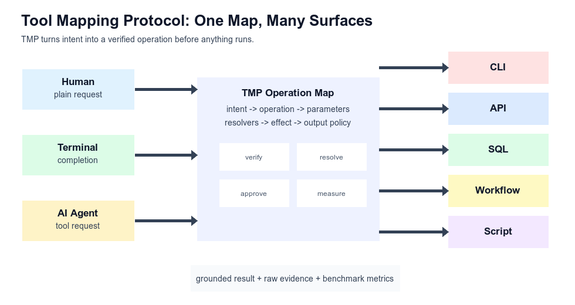
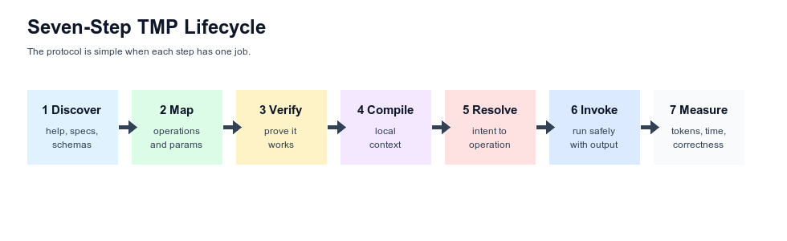
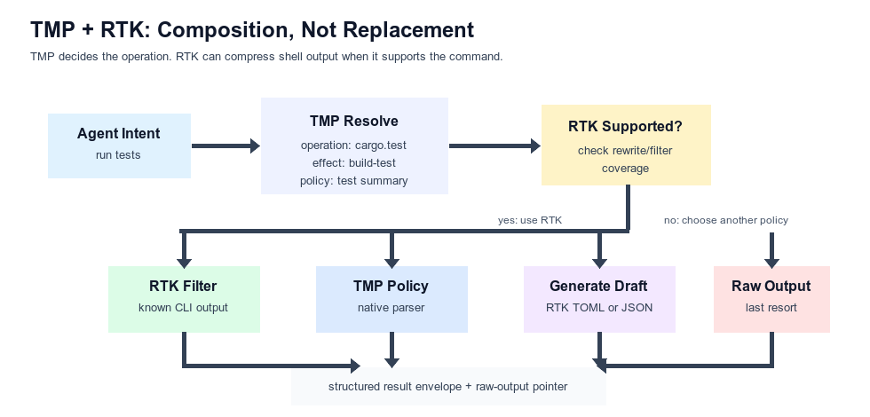
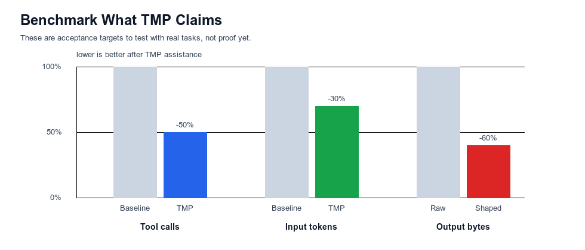

# Executive Summary

Tool Mapping Protocol, or TMP, is a protocol for turning intent into a verified operation.

Plain English:

> TMP is a map. Before a human, terminal, or AI agent runs something, TMP shows the correct road, the required inputs, the possible side effects, and the shape of the result.

The first implementation is a Rust CLI named `tmp`, but the protocol is bigger than a CLI. TMP can map:

| Surface | Example | TMP Value |
| --- | --- | --- |
| CLI | `cargo test` | known flags |
| API | `POST /deployments` | schema + effects |
| SQL | `recent_failed_jobs` | safe templates |
| Workflow | `release_candidate` | ordered steps |
| Script | `sync-data` | documented args |
| Completion | `<TAB>` | dynamic values |
| Agent tool | `resolve_intent` | grounded lookup |
| Output policy | test summary | less noise |

TMP should create three measurable benefits:

| Claim | Meaning | Evidence |
| --- | --- | --- |
| Grounded actions | tied to a verified map | invalid attempts |
| Fewer tool calls | less discovery work | call delta |
| Lower token usage | less context and noise | token/byte delta |



# The Problem

Modern developer environments have many ways to perform actions:

- Commands have flags.
- APIs have endpoints.
- Databases have schemas and constraints.
- Workflows have steps.
- Scripts have undocumented arguments.
- Terminals need completion candidates.
- Agents need safe tool calls.

Without TMP, an AI agent often has to do this:

```text
read files
  -> search scripts
  -> inspect docs
  -> run help
  -> guess command
  -> run
  -> recover
```

That is expensive and unreliable.

With TMP, the flow becomes:

```text
compile map
  -> resolve intent
  -> invoke verified operation
  -> return shaped result
```

The important rule:

> If TMP cannot resolve the operation, it should fail closed. A visible "not mapped" result is better than a confident guess.

# Core Model

TMP is built around one unit: the operation.

```text
surface -> operation -> parameters -> resolvers -> invocation -> effect -> output policy
```

| Term | Meaning | Example |
| --- | --- | --- |
| Surface | Where the action lives. | CLI, API, SQL, workflow, script. |
| Operation | A thing that can be invoked. | `cargo.test`, `sql.recent_failed_jobs`. |
| Parameter | Input required by the operation. | `branch`, `environment`, `limit`. |
| Resolver | How valid values are discovered. | `git:branches`, `cargo:bins`, `sql:tables`. |
| Invocation | The concrete action to perform. | shell command, HTTP request, query template. |
| Effect | What can happen. | read-only, build-test, network, deployment, destructive. |
| Output policy | How results are returned. | raw, test summary, diff summary, JSON projection. |
| Evidence | Why the map is trusted. | help text, test, human review, registry signature. |

## Minimal Operation Record

```json
{
  "id": "cargo.test",
  "surface": "cli",
  "intent": ["test", "run tests", "unit tests"],
  "template": "cargo test <test_filter>",
  "parameters": [
    {
      "name": "test_filter",
      "type": "string",
      "required": false,
      "resolver": "cargo:tests"
    }
  ],
  "effect": "build-test",
  "risk": "low",
  "output_policy": {
    "mode": "test_summary",
    "raw_retention": "local_file"
  },
  "verified": true,
  "evidence": ["parsed_help", "dry_run", "human_review"]
}
```

This record should be enough for a terminal, CLI, API adapter, registry, or agent-facing tool to understand the operation without reading a full manual.

# Lifecycle

TMP should be implemented as a sequence. Each step has one job.



| Step | Input | Output | Failure |
| --- | --- | --- | --- |
| Discover | specs, help, files | raw facts | record gaps |
| Map | raw facts | operation map | mark draft |
| Verify | map + samples | evidence | stay draft |
| Compile | map + context | `.tmp/context.*` | unresolved values |
| Resolve | intent | operation + params | no action |
| Invoke | resolved op | result | require approval |
| Measure | run data | metrics | no data, no claim |

# Use Cases

## Terminal Completion

TMP can provide context-aware completion values.

```text
cargo run --bin <TAB>
```

Expected TMP behavior:

```json
{
  "operation": "cargo.run_bin",
  "parameter": "bin",
  "values": ["tmp", "tmp-agent", "schema-gen"]
}
```

The terminal does not need to scrape every help page. TMP already knows the operation and can use resolvers such as `cargo:bins`, `git:branches`, or `npm:scripts`.

## AI Agent Tool Use

An agent can call TMP before running unknown commands.

```text
User: Run parser unit tests.
Agent: tmp resolve "run parser unit tests"
TMP: cargo test parser
Agent: tmp run
```

The agent no longer needs to infer the command from scratch. It also gets a failure if the action is unmapped.

## API Mapping

```yaml
intent: create staging deployment
surface: api
operation: deployments.create
method: POST
path: /deployments
parameters:
  environment: staging
  ref: current_git_branch
effect: deployment
risk: high
approval: required
```

TMP can make API actions visible to agents and workflows without forcing the model to invent request bodies.

## SQL Mapping

```sql
-- operation: sql.recent_failed_jobs
SELECT id, status, created_at
FROM jobs
WHERE status = ?
ORDER BY created_at DESC
LIMIT ?;
```

TMP should prefer allowed query templates over free-form SQL generation. This keeps read and write risk explicit.

## Workflow and Script Mapping

```yaml
operation: release_candidate
surface: workflow
steps:
  - cargo.test
  - cargo.build_release
  - changelog.generate
  - artifact.publish_draft
effect: local-write + network
risk: high
approval: required
```

The workflow becomes one named operation with visible internal steps.

# Output Shaping

TMP should treat output as part of the operation contract.

```text
intent + context -> operation + parameters + invocation + output policy
```

There are two token-reduction moments:

| Moment | What TMP Reduces | Example |
| --- | --- | --- |
| Before invocation | exploratory tool calls and long context | Resolve `run parser tests` in one call. |
| After invocation | noisy command output | Return failing tests, not all passing test lines. |

Output policies should preserve signal and collapse noise.

| Command Class | Preserve | Collapse |
| --- | --- | --- |
| Tests | failures, panic text, compiler errors, counts, exit status | passing tests, progress lines, ANSI codes |
| Git status | branch, staged, unstaged, untracked, ahead/behind | hints and repeated boilerplate |
| Diffs | changed files, hunk headers, selected relevant hunks | long unchanged context |
| Search | matched files, counts, bounded snippets | duplicates and excessive context |
| Logs | recent errors, warnings, service, timestamp, trace IDs | repeated heartbeat lines |

Raw output should still be retained locally. Compact output is for the context window; raw output is for audit and debugging.

# TMP and RTK

RTK stands for Rust Token Killer. RTK is a local command proxy for AI-assisted development workflows. It runs shell commands, filters noisy output, and returns a smaller result before the output reaches the agent context window.

RTK is useful because terminal output often contains low-value text:

- Passing test names when only failures matter.
- Progress bars.
- ANSI control sequences.
- Repeated warnings.
- Long unchanged diff context.
- Boilerplate package-manager output.
- Repeated log events.

TMP and RTK solve different layers of the problem.

| Layer | TMP | RTK |
| --- | --- | --- |
| Main question | What operation should run? | How should known shell output be compressed? |
| Scope | CLI, API, SQL, workflows, scripts, completion, agents | Shell command output |
| Trust model | verified operation maps and evidence | supported command handlers and filters |
| Dynamic generation | can draft maps and output policies | supports known handlers plus user filters |
| Failure mode | fail closed when no operation maps | pass through or use available filters |



## Combined Flow

```text
agent intent
  -> TMP resolves a verified operation
  -> TMP fills parameters
  -> TMP checks effect, risk, and approval
  -> TMP invokes the operation
  -> RTK compresses output if the CLI command is supported
  -> TMP wraps the result in a structured envelope
  -> agent receives compact, grounded output
```

Example result envelope:

```json
{
  "operation_id": "cargo.test",
  "invocation": "cargo test",
  "compressor": "rtk",
  "exit_status": 101,
  "success": false,
  "summary": {
    "failed_tests": 2,
    "passed_tests": 148,
    "first_failure": "parser::tests::rejects_invalid_escape",
    "failure_file": "crates/parser/src/tests.rs"
  },
  "omitted": {
    "passing_test_lines": 148,
    "progress_lines": 22,
    "ansi_sequences": "removed"
  },
  "raw_output": {
    "retained": true,
    "location": ".tmp/runs/2026-06-03T10-30-00Z/raw.log"
  }
}
```

## Unsupported RTK Commands

RTK does not need to support every command for TMP to be valuable. If RTK has no handler or filter, TMP should choose one of four paths:

| Path | When to Use | Result |
| --- | --- | --- |
| Use RTK | RTK supports the command or user filter. | Fast CLI output reduction. |
| TMP-native policy | Output needs structured parsing or is not shell output. | Operation-aware summary. |
| Generate RTK draft | Output is line-oriented and filterable. | Draft `.rtk/filters.toml` plus tests. |
| Raw passthrough | No safe summarizer exists. | Full output plus measurement data. |

Proposed command:

```bash
tmp generate rtk <operation-id>
```

This should generate a draft filter from an existing TMP operation and representative output samples. It should not silently create trusted filters.

Draft RTK-compatible filter:

```toml
[filters.scripts-codegen]
description = "Compact scripts.codegen output"
match_command = "^\\./scripts/codegen\\b"
strip_ansi = true
strip_lines_matching = [
  "^\\s*$",
  "^Generated unchanged file:",
  "^Checking cache"
]
max_lines = 80
on_empty = "scripts.codegen: ok"

[[tests.scripts-codegen]]
name = "preserves generated file and error summary"
input = "..."
expected = "..."
```

Safety rule:

> Generated filters are drafts until sample tests pass and a user or maintainer reviews them.

# Build Blueprint

This section is written so the crates can be rebuilt from scratch.

## Workspace Shape

| Crate | Responsibility | Must Not Own |
| --- | --- | --- |
| `tmp-core` | schema model, discovery, generation, compilation, resolution, invocation, registry, output policy contracts | terminal UI and CLI argument parsing |
| `tmp` | user-facing CLI, subcommands, TUI verification, file output | protocol business logic |
| `crates/command` | optional command execution abstractions and process helpers | TMP schema semantics |
| `crates/tmp-agent` | optional agent-facing adapter or test harness | deterministic core resolver |

The deterministic core should not call model APIs. If AI helps generate schemas or filters, the user-selected external agent should produce draft files that TMP verifies.

## Required Artifacts

| Artifact | Purpose |
| --- | --- |
| `.tmp/config.json` | Local TMP settings and registry paths. |
| `.tmp/schemas/*.json` | Operation maps and CLI schemas. |
| `.tmp/context.json` | Machine-readable compiled context. |
| `.tmp/context.md` | Agent-readable compact context. |
| `.tmp/last-resolve.json` | Last resolved operation and parameters. |
| `.tmp/runs/*/raw.log` | Raw output retained for audit. |
| `.tmp/runs/*/summary.json` | Structured output summary. |
| `.rtk/filters.toml` | Optional RTK-compatible generated filter drafts. |

## CLI Contract

| Command | Purpose | Output Contract |
| --- | --- | --- |
| `tmp init` | Create local config and directories. | Files created or already exist. |
| `tmp generate <tool>` | Draft schema from help/discovery. | `verified: false` schema version. |
| `tmp verify <schema>` | Review or test schema. | Evidence added or errors reported. |
| `tmp compile` | Build context and command maps. | `.tmp/context.json` and `.tmp/context.md`. |
| `tmp resolve "<intent>"` | Match intent to operation. | operation ID, filled params, confidence. |
| `tmp run` | Invoke last resolved operation. | exit status and output policy result. |
| `tmp output show --last --raw` | Reveal retained raw output. | raw output path or content. |
| `tmp schema import/list/share` | Manage local schemas. | stable JSON and human-readable summaries. |
| `tmp registry search/install/publish` | Share verified maps. | registry metadata and checksums. |
| `tmp workflow add/run/list` | Manage mapped workflows. | workflow execution status. |
| `tmp generate rtk <operation-id>` | Draft RTK-compatible output filter. | unverified TOML or TMP-native policy. |
| `tmp benchmark run` | Measure hypotheses. | benchmark JSON matching schema. |

## Core Traits

These are conceptual interfaces, not final Rust syntax.

```rust
trait SurfaceAdapter {
    fn discover(&self, context: &Context) -> Vec<RawFact>;
    fn map(&self, facts: &[RawFact]) -> Vec<OperationDraft>;
    fn invoke(&self, op: &ResolvedOperation) -> InvocationResult;
}

trait Resolver {
    fn values(&self, parameter: &Parameter, context: &Context) -> Vec<Value>;
}

trait OutputPolicy {
    fn shape(&self, raw: RawOutput, op: &ResolvedOperation) -> OutputSummary;
}

trait EvidenceCheck {
    fn verify(&self, operation: &Operation) -> EvidenceResult;
}
```

## Fail-Closed Invariants

These rules should be tested.

| Invariant | Why It Matters |
| --- | --- |
| Unknown intent does not invoke anything. | Prevents hallucinated operations. |
| Draft maps are never treated as verified. | Prevents false trust. |
| High-risk effects require approval. | Prevents accidental destructive actions. |
| Dynamic resolver failure is visible. | Prevents hidden wrong defaults. |
| Raw output is retained when output is shaped. | Preserves auditability. |
| Generated RTK filters remain draft until tested. | Prevents lossy generated compression. |
| The core resolver is deterministic. | Keeps TMP independent of AI providers. |

## Minimum Test Suite

| Area | Tests |
| --- | --- |
| Schema | parse, validate, reject invalid parameter names, preserve versions. |
| Discovery | parse help text, mark drafts unverified, handle missing commands. |
| Compile | write context artifacts, resolve dynamic values, keep output compact. |
| Resolve | select expected operation, fill parameters, fail closed. |
| Run | execute dry run and real command, store raw and summary output. |
| Output policy | preserve failure signal, record omitted counts, keep raw pointer. |
| Registry | install, share, publish metadata, checksum verification. |
| End-to-end | init -> generate -> verify -> compile -> resolve -> run. |
| Benchmarks | compare baseline vs TMP-assisted metrics. |

# Product Roadmap

| Phase | Goal | Exit Criteria |
| --- | --- | --- |
| 1 | Stabilize CLI mapping | schemas, compile, resolve, run pass end-to-end tests. |
| 2 | General operation map | surface, effect, evidence, output policy fields exist. |
| 3 | Completion adapter | dynamic parameter completions work for common CLI cases. |
| 4 | Output policy adapter | tests, diffs, status, search, and logs can be summarized. |
| 5 | Agent adapter | list, resolve, invoke, explain, read summary, read raw. |
| 6 | Registry | verified maps can be shared with checksums and trust metadata. |
| 7 | SQL/API/workflow adapters | non-CLI operations can be mapped and invoked safely. |
| 8 | Benchmark harness | claims are measured and published. |

# Benchmark Plan

TMP should not rely on claims. It should measure them.



| Metric | Baseline | TMP-Assisted | Target |
| --- | --- | --- | --- |
| Tool calls | Agent discovers manually. | Agent resolves through TMP. | 50% reduction for common CLI tasks. |
| Input tokens | Agent reads docs, files, help. | Agent reads compact context. | 30% reduction for discovery-heavy tasks. |
| Output tokens | Raw command output enters context. | Output policy shapes result. | 60% reduction for noisy commands. |
| Invalid operations | Agent may guess wrong. | TMP fails closed. | Zero for verified maps. |
| Completion precision | Shell guesses or generic completion. | TMP resolver candidates. | 90% precision at 5. |

Benchmark run record:

```json
{
  "run_id": "2026-06-03T00-00-00Z-cli-parser-tests",
  "task_id": "cli.parser_tests",
  "mode": "tmp_assisted",
  "surface": "cli",
  "tool_calls": 2,
  "input_tokens": 1200,
  "output_tokens": 300,
  "raw_output_bytes": 24000,
  "shaped_output_bytes": 2600,
  "output_signal_preserved": true,
  "wall_time_ms": 4200,
  "success": true,
  "invalid_operation_attempted": false,
  "user_clarifications": 0,
  "failed_attempts": 0
}
```

# Comparison With Adjacent Systems

| System | What It Does | TMP Relationship |
| --- | --- | --- |
| MCP | Exposes tools to models. | TMP maps valid operations behind those tools. |
| OpenAPI | Describes HTTP APIs. | TMP imports or maps API operations into safe workflows. |
| Shell completion | Provides command candidates. | TMP supplies context-aware operation and parameter candidates. |
| RTK | Compresses supported shell command output. | TMP can use RTK as a CLI output adapter. |
| Workflow engines | Run ordered steps. | TMP maps workflows as operations with effects and approvals. |

TMP should not compete with these systems. It should be the mapping layer they can use.

# Architecture Risks

| Risk | Failure Mode | Correction |
| --- | --- | --- |
| Everything becomes a tool | Registry becomes noisy and vague. | Require operation IDs, parameters, effects, and evidence. |
| Draft maps look trusted | Agent-generated schemas are accepted too early. | Keep `verified: false` until evidence passes. |
| CLI dominates the design | SQL/API/workflow cases become afterthoughts. | Keep surface adapters in the core model. |
| TMP becomes an AI wrapper | Provider keys and model behavior enter the resolver. | Keep generation external and resolver deterministic. |
| Compression hides evidence | Agent misses important failures. | Retain raw output and benchmark signal preservation. |
| Registry trust is weak | Users install unsafe maps. | Use checksums, publisher metadata, compatibility, and review status. |

# Conclusion

TMP is a protocol for mapping intent to verified operations.

The simplest explanation is:

```text
Ask -> Map -> Verify -> Run -> Summarize -> Measure
```

If TMP succeeds, it becomes shared infrastructure for terminals, agents, workflows, APIs, SQL systems, scripts, and registries. Its value is not only running commands. Its value is making actions knowable before they run and measurable after they run.

The implementation should stay deterministic at the core, support external agent-assisted generation only as draft input, and prove its claims through benchmarks.
